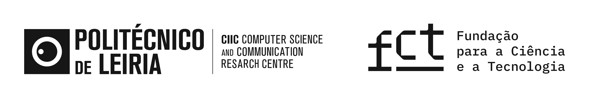

## SP-IA: Secure & Privacy-Preserving Machine Learning

---

    

---

### Description

This repository is part of the `SP-IA` project, focusing on **Secure and Privacy-Preserving Machine Learning**. The main objectives of this project include:

- Conducting a survey on the security and privacy risks associated with various machine learning techniques.
- Analyzing and proposing potential countermeasures to enhance security and privacy protection.
- Selecting, implementing, and experimentally evaluating alternative approaches.
- Preparing a final report and scientific papers in a suitable format for publication.

Please refer to the documentation and resources provided in this repository for more information on the SP-IA project and its progress.

### Content Overview
This repository covers a diverse range of resources and materials that have been carefully analised to support research and development in the field of security and privacy-preserving of machine learning.

- **Notebooks**: A collection of `Jupyter Notebooks` developed to support debugging and development within the project.
- **Modules**: A set of `Python` modules intended for debugging and development assistance.
- **SGA**: Code implementation for the [SGA](https://github.com/liuxuannan/Stochastic-Gradient-Aggregation) attack.
- **SuperstarGAN**: Code implementation for the [SuperstarGAN](https://github.com/KKhyeok/SuperstarGAN) model.
- **TRM**: Code implementation for the [TRM](https://github.com/RandolphCarter0/TRMUAP) attack.

### Acknowledgements

This work is funded by [FCT](https://www.fct.pt/), through the project UIDB/04524/2020.
